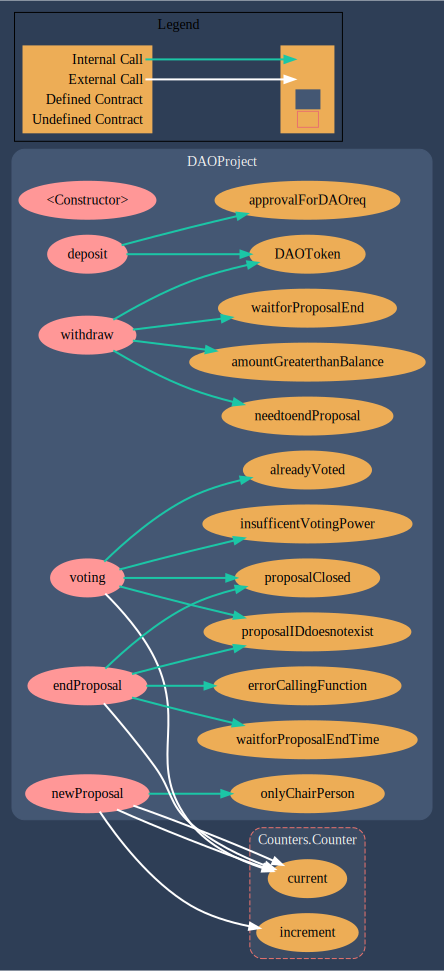

# DAO Project

 
 A DAO Project that will call the function signature through user voting.

DAO Project Contract: https://rinkeby.etherscan.io/address/0xA0fb24110701198b7E2CA134AF2F822B1c0f8286#code

DAO Token Contract: https://rinkeby.etherscan.io/address/0x6c7824059712cf021c0692176d2d62665832ee3b#code

Test Call Contract: https://rinkeby.etherscan.io/address/0x88a0dd621b87e056d7db03e6a34ed540babc3c4d#code

Visual Call Graph



This project demonstrates an advanced Hardhat use case, integrating other tools commonly used alongside Hardhat in the ecosystem.

The project comes with a sample contract, a test for that contract, a sample script that deploys that contract, and an example of a task implementation, which simply lists the available accounts. It also comes with a variety of other tools, preconfigured to work with the project code.

Try running some of the following tasks:

```shell
npx hardhat accounts
npx hardhat compile
npx hardhat clean
npx hardhat test
npx hardhat node
npx hardhat help
REPORT_GAS=true npx hardhat test
npx hardhat coverage
npx hardhat run scripts/deploy.ts
TS_NODE_FILES=true npx ts-node scripts/deploy.ts
npx eslint '**/*.{js,ts}'
npx eslint '**/*.{js,ts}' --fix
npx prettier '**/*.{json,sol,md}' --check
npx prettier '**/*.{json,sol,md}' --write
npx solhint 'contracts/**/*.sol'
npx solhint 'contracts/**/*.sol' --fix
```